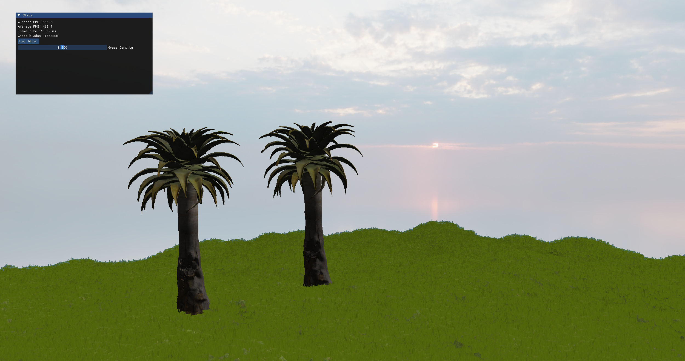
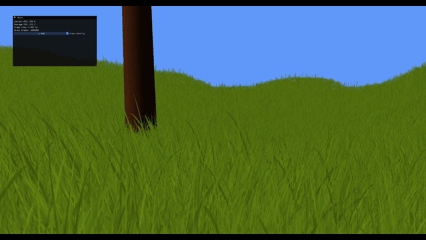

## Build Instructions

### Prerequisites

- CMake ≥ 3.20
- A C++17-capable compiler  
  - On Windows: Visual Studio 2022 (with Desktop development with C++)
- Git (for pulling submodules)

### Clone and fetch submodules

```bash
git clone https://github.com/dudujuju828/GraphicsEngine.git GraphicsEngine
cd GraphicsEngine
git submodule update --init --recursive
```

This pulls the external dependencies into `external/` (Assimp, GLFW, GLM, ImGui, spdlog, etc.).

### Configure the build

From the project root (where `CMakeLists.txt` lives):

```bash
cmake -S . -B build
```

This generates project files under `build/`.

### Build

On Windows (MSBuild / Visual Studio generator):

```bash
cmake --build build --config Debug
# or
cmake --build build --config Release
```

This produces `main.exe` under:

- `build/Debug/main.exe` for Debug  
- `build/Release/main.exe` for Release

### Run

From the project root:

```bash
./build/Debug/main.exe
# or
./build/Release/main.exe
```

All third-party libraries are built and linked statically, so no extra DLL setup should be required.

---

## Demonstrations
### Youtube
https://www.youtube.com/@maxthomarino

### Skybox


### Object Loading
  


### Perlin Noise


### Spdlog-ing

